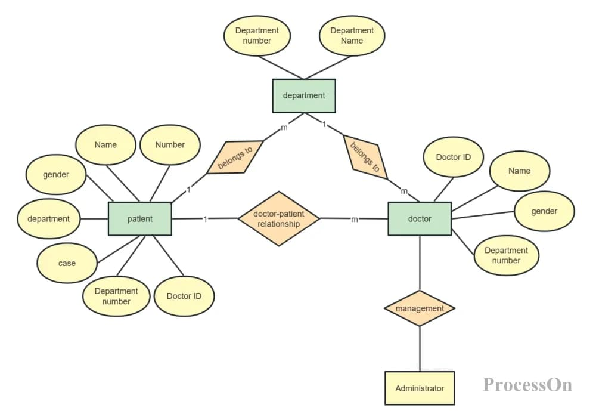

# Графы знаний (Knowledge Graphs)

## Основная концепция

**Граф знаний** — структура данных, представляющая информацию в виде сети связанных сущностей.

## Форматы представления

### Триплет (SPO)

$$
\text{Triple} = (\text{Subject},\ \text{Predicate},\ \text{Object})
$$

**Пример**: `(Albert Einstein, developed, Theory of Relativity)`

## Таблица примеров триплетов

| Subject | Predicate | Object |
|---------|-----------|--------|
| Steve Jobs | founded | Apple Inc. |
| Paris | is_capital_of | France |
| Python | is_programming_language | — |
| GraphRAG | improves | RAG Systems |

## Математическое представление графа

Граф $G = (V, E)$ состоит из:
- $V$ — множество вершин (узлов)
- $E \subseteq V \times V$ — множество рёбер

Степень узла $v$:

$$
\deg(v) = |\{(v, u) \in E\}|
$$

## Типы графов в GraphRAG

$$
\text{Knowledge Graph Types:} \begin{cases}
\text{Entity Graph} & \text{— основные сущности} \\
\text{Relation Graph} & \text{— связи между сущностями} \\
\text{Community Graph} & \text{— иерархия сообществ}
\end{cases}
$$
