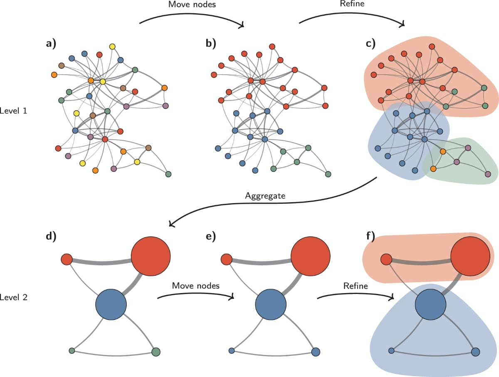

# Алгоритм Leiden для детекции сообществ

## Что такое Leiden?

**Leiden** — алгоритм иерархической кластеризации графов, используемый в GraphRAG
для группировки связанных сущностей.

## Шаги алгоритма

| Этап | Описание | Формула |
|------|----------|---------|
| 1. Инициализация | Каждый узел = отдельное сообщество | $c_i = i,\ \forall i \in V$ |
| 2. Локальное перемещение | Узлы переносятся в сообщества соседей | Максимизация $\Delta Q$ |
| 3. Агрегация | Сообщества становятся узлами | Создание мета-графа |
| 4. Рефинемент | Улучшение разбиения | Повторение шагов 1–2 |

## Функция модулярности

$$
Q = \frac{1}{2m} \sum_{c} \left[ e_c - \frac{K_c^2}{2m} \right]
$$

где:
- $m$ — общее число рёбер
- $e_c$ — число рёбер внутри сообщества $c$
- $K_c$ — сумма степеней узлов в сообществе $c$

## Преимущества Leiden над Louvain

1. **Гарантия связности** — все сообщества связны
2. **Быстрая сходимость** — $O(n \log n)$
3. **Масштабируемость** — работает с миллионами узлов

## Применение в GraphRAG

$$
\text{Entities} \xrightarrow{\text{Leiden}} \text{Communities} \xrightarrow{\text{LLM}} \text{Summaries}
$$
