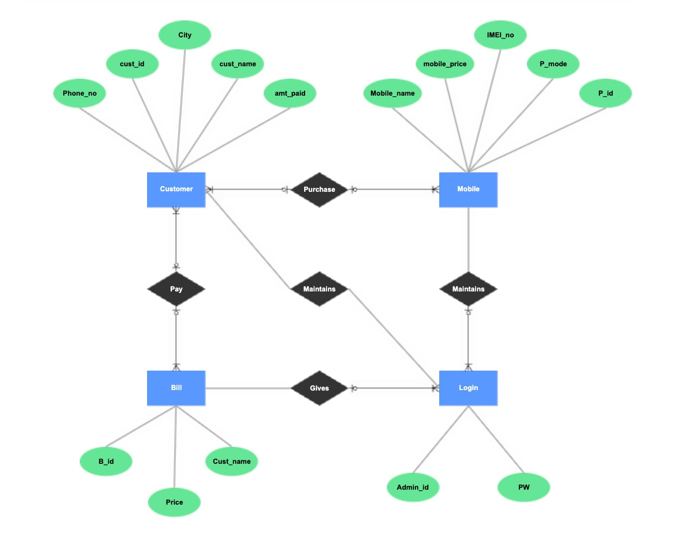

# Извлечение сущностей и связей

## Процесс извлечения

GraphRAG использует LLM для автоматического извлечения сущностей из текста.

## Типы сущностей

| Тип | Примеры | Обозначение |
|-----|---------|-------------|
| **PERSON** | Albert Einstein, Steve Jobs | $E_\text{person}$ |
| **ORGANIZATION** | Microsoft, Apple, IBM | $E_\text{org}$ |
| **LOCATION** | Paris, USA, Silicon Valley | $E_\text{loc}$ |
| **CONCEPT** | GraphRAG, AI, Machine Learning | $E_\text{concept}$ |
| **EVENT** | Merger, Conference, Release | $E_\text{event}$ |

## Извлечение связей

Связь представляется как:

$$
r: E \times E \to R
$$

**Примеры**:
- `(Microsoft, developed, GraphRAG)`
- `(GraphRAG, improves, RAG)`
- `(RAG, uses, LLM)`

## Метрики точности

$$
\text{Precision} = \frac{TP}{TP + FP}, \qquad \text{Recall} = \frac{TP}{TP + FN}
$$

При использовании GPT-4: Precision ≈ 0.92, Recall ≈ 0.87.
